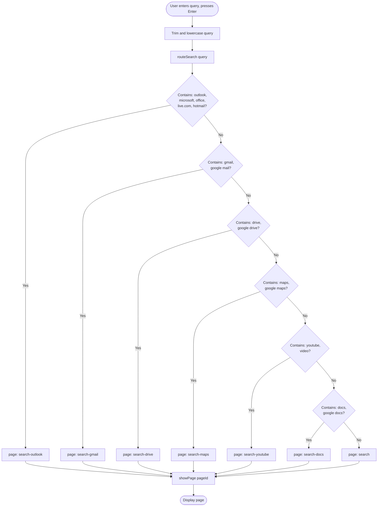
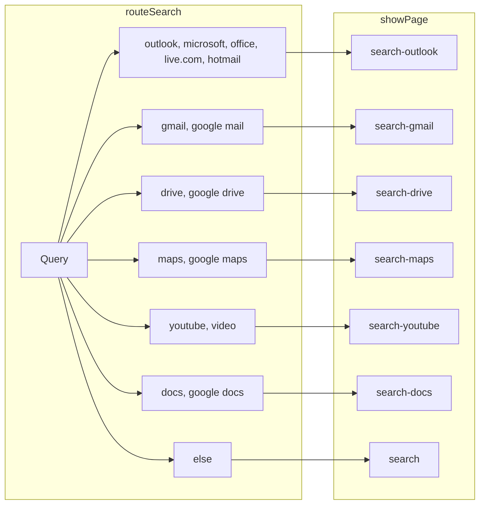

# Search and Address Bar Routing – Flowchart

## Flowchart (Mermaid)

## Simplified View (Query → Page Mapping)

## Address Bar Special Cases

The address bar has additional logic before `routeSearch`:

- **dashboard**, **session**, **session data** → `goToDashboard()` (skip routing)
- **outlook**, **microsoft**, **office**, **live**, **hotmail** → `showPage("outlook-login")` (direct login)
- **mail**, **gmail** → `showPage("gmail-login")`
- **drive** → `showPage("drive-login")`
- **maps** → `showPage("maps-login")`
- **youtube**, **video** → `showPage("youtube-login")`
- **docs** → `showPage("docs-login")`
- **else** → `showPage(routeSearch(query))` (use flowchart above)

---

**How to view:** Paste the Mermaid code into [mermaid.live](https://mermaid.live) to render and export as PNG/SVG for your dissertation.
